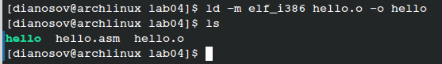

---
## Front matter
title: "Отчёт по лабораторной работе №4"
subtitle: "дисциплина: Архитектура компьютера"
author: "Аносов Даниил Игоревич"

## Generic otions
lang: ru-RU
toc-title: "Содержание"

## Bibliography
bibliography: bib/cite.bib
csl: pandoc/csl/gost-r-7-0-5-2008-numeric.csl

## Pdf output format
toc: true # Table of contents
toc-depth: 2
lof: true # List of figures
lot: true # List of tables
fontsize: 12pt
linestretch: 1.5
papersize: a4
documentclass: scrreprt
## I18n polyglossia
polyglossia-lang:
  name: russian
  options:
	- spelling=modern
	- babelshorthands=true
polyglossia-otherlangs:
  name: english
## I18n babel
babel-lang: russian
babel-otherlangs: english
## Fonts
mainfont: IBM Plex Serif
romanfont: IBM Plex Serif
sansfont: IBM Plex Sans
monofont: IBM Plex Mono
mathfont: STIX Two Math
mainfontoptions: Ligatures=Common,Ligatures=TeX,Scale=0.94
romanfontoptions: Ligatures=Common,Ligatures=TeX,Scale=0.94
sansfontoptions: Ligatures=Common,Ligatures=TeX,Scale=MatchLowercase,Scale=0.94
monofontoptions: Scale=MatchLowercase,Scale=0.94,FakeStretch=0.9
mathfontoptions:
## Biblatex
biblatex: true
biblio-style: "gost-numeric"
biblatexoptions:
  - parentracker=true
  - backend=biber
  - hyperref=auto
  - language=auto
  - autolang=other*
  - citestyle=gost-numeric
## Pandoc-crossref LaTeX customization
figureTitle: "Рис."
tableTitle: "Таблица"
listingTitle: "Листинг"
lofTitle: "Список иллюстраций"
lotTitle: "Список таблиц"
lolTitle: "Листинги"
## Misc options
indent: true
header-includes:
  - \usepackage{indentfirst}
  - \usepackage{float} # keep figures where there are in the text
  - \floatplacement{figure}{H} # keep figures where there are in the text
---

# Цель работы

Приобретение навыков работы с ассемблерным языком NASM, в том числе навыков компиляции и обработки объектных *.o*-файлов.

# Задание

Скопировать и отредактировать код на NASM. Скомпилировать файлы с кодом. Обработать их и сделать их исполнимыми. Проверить работоспособность кода.

# Выполнение лабораторной работы

Откроем терминал и перейдём в каталог курса (рис. [-@fig:001]).
 Создадим каталог lab04 для работы с NASM, тронем в нём файл *hello.asm*

{#fig:001 width=70%}

В файл *hello.asm* поместим код, предложенный в документе, приложенном к лабораторной работе (рис. [-@fig:002]).

{#fig:002 width=70%}

Заметим, что в отличие от многих современных высокоуровневых языков программирования, в ассемблерной программе каждая команда располагается на отдельной строке. Размещение нескольких команд на одной строке недопустимо. 

Пакетным менеджером *pacman* установим компилятор ассемблера *nasm*. (рис. [-@fig:003]).

{#fig:003 width=70%}

Проведём компиляцию программы, убедимся, что выходные файлы появились в директории (рис. [-@fig:004]).

{#fig:004 width=70%}

Чтобы получить исполняемую программу, объектный файл
необходимо передать на обработку компоновщику. Проделаем это, как показано на картинке (рис. [-@fig:005]).

{#fig:005 width=70%}

Как видно, появился исполняемый файл **hello**

Проверим, что программа исполняется корректно (рис. [-@fig:006]).

{#fig:006 width=70%}

Скопируем файл с кодом и назовём новый экземпляр *lab04.asm*, проверим, что весь код на месте (рис. [-@fig:007]).

{#fig:007 width=70%}

# Задание для самостоятельной работы

Откроем файл с помощью редактора *vim*.
В коде вместо *Hello world* напишем фамилию и имя автора лабораторной работы. Для семантики также поменяем *hello* на *name* (рис. [-@fig:008]).

{#fig:008 width=70%}

Скомпилируем код и обработаем его компоновщиком (аналогично предыдущему примеру) (рис. [-@fig:009]).

{#fig:009 width=70%}

Запустим полученный на выходе исполняемый файл **lab04** и убедимся, что код работает корректно (рис. [-@fig:010]).

{#fig:010 width=70%}

{#fig:011 width=70%}

Скопируем всё содержимое текущего каталога в *~/study/arch-pc/labs/lab04/report/**asm-dir*** (рис. [-@fig:011]).

Загрузим на Github всю новую версию проекта.
{#fig:012 width=70%}\
{#fig:013 width=70%}

# Выводы

В ходе выполнения данной лабораторной работы была освоена процедура написания простого кода с выводом данных в терминал на ассемблерном языке NASM.
