---
## Front matter
title: "Отчёт по лабораторной работе №4"
subtitle: "дисциплина: Архитектура компьютера"
author: "Аносов Даниил Игоревич"

## Generic otions
lang: ru-RU
toc-title: "Содержание"

## Bibliography
bibliography: bib/cite.bib
csl: pandoc/csl/gost-r-7-0-5-2008-numeric.csl

## Pdf output format
toc: true # Table of contents
toc-depth: 2
lof: true # List of figures
lot: true # List of tables
fontsize: 12pt
linestretch: 1.5
papersize: a4
documentclass: scrreprt
## I18n polyglossia
polyglossia-lang:
  name: russian
  options:
	- spelling=modern
	- babelshorthands=true
polyglossia-otherlangs:
  name: english
## I18n babel
babel-lang: russian
babel-otherlangs: english
## Fonts
mainfont: IBM Plex Serif
romanfont: IBM Plex Serif
sansfont: IBM Plex Sans
monofont: IBM Plex Mono
mathfont: STIX Two Math
mainfontoptions: Ligatures=Common,Ligatures=TeX,Scale=0.94
romanfontoptions: Ligatures=Common,Ligatures=TeX,Scale=0.94
sansfontoptions: Ligatures=Common,Ligatures=TeX,Scale=MatchLowercase,Scale=0.94
monofontoptions: Scale=MatchLowercase,Scale=0.94,FakeStretch=0.9
mathfontoptions:
## Biblatex
biblatex: true
biblio-style: "gost-numeric"
biblatexoptions:
  - parentracker=true
  - backend=biber
  - hyperref=auto
  - language=auto
  - autolang=other*
  - citestyle=gost-numeric
## Pandoc-crossref LaTeX customization
figureTitle: "Рис."
tableTitle: "Таблица"
listingTitle: "Листинг"
lofTitle: "Список иллюстраций"
lotTitle: "Список таблиц"
lolTitle: "Листинги"
## Misc options
indent: true
header-includes:
  - \usepackage{indentfirst}
  - \usepackage{float} # keep figures where there are in the text
  - \floatplacement{figure}{H} # keep figures where there are in the text
---

# Цель работы

Приобретение практических навыков работы в Midnight Commander. Освоение инструкций языка ассемблера mov и int.

# Задание

1. Создайте копию файла lab5-1.asm. Внесите изменения в программу (без использования внешнего файла in_out.asm), так чтобы она работала по следующему алгоритму:
• вывести приглашение типа “Введите строку:”;
• ввести строку с клавиатуры;
• вывести введённую строку на экран.
2. Получите исполняемый файл и проверьте его работу. На приглашение ввести строку введите свою фамилию.
3. Создайте копию файла lab5-2.asm. Исправьте текст программы с использование подпрограмм из внешнего файла in_out.asm, так чтобы она работала по следующему алгоритму:
• вывести приглашение типа “Введите строку:”;
• ввести строку с клавиатуры;
• вывести введённую строку на экран.

# Выполнение лабораторной работы

Откроем терминал и установим пакет **mc** - *Midnight Commander* с помощью пакетного менеджера **pacman**. (рис. [-@fig:001]).

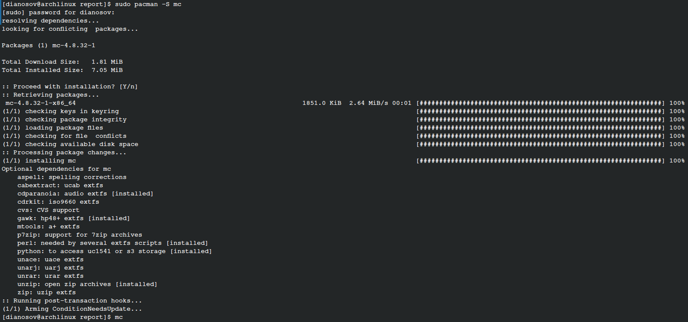{#fig:001 width=70%}

Введём команду *mc*, чтобы открыть Midnight Commander. (рис. [-@fig:002]).

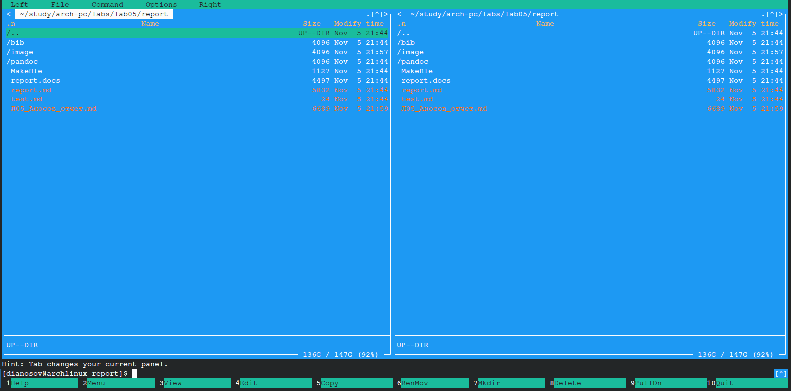{#fig:002 width=70%}

В Midnight Commander в одной из панелей откроем каталог курса *~/study/arch-pc* (рис. [-@fig:003]).

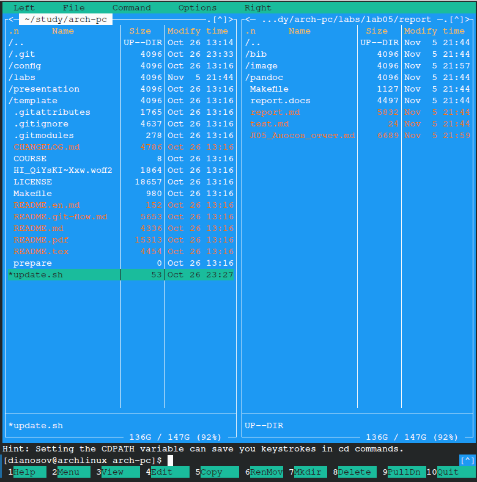{#fig:003 width=70%}

С помощью функциональной клавиши F7 создадим папку lab05. (рис. [-@fig:004]).

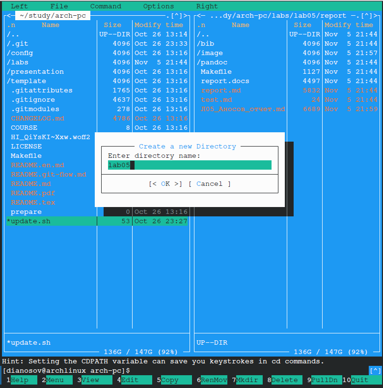{#fig:004 width=70%}

Перейдём в созданный каталог. (рис. [-@fig:005]).

{#fig:005 width=70%}

В созданном каталоге создадим файл **lab5-1.asm** (рис. [-@fig:006]).

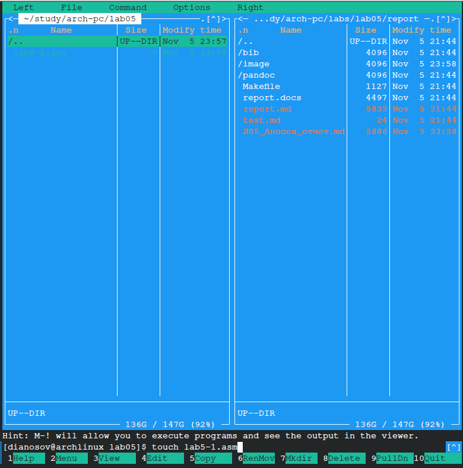{#fig:006 width=70%}

С помощью функциональной клавиши F4 откроем файл lab5-1.asm для редактирования во встроенном редакторе. (рис. [-@fig:007]).

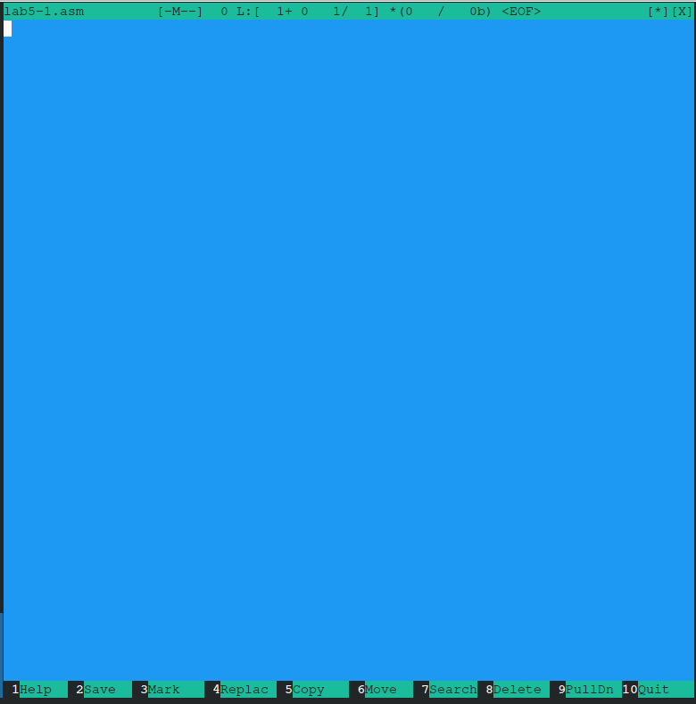{#fig:007 width=70%}

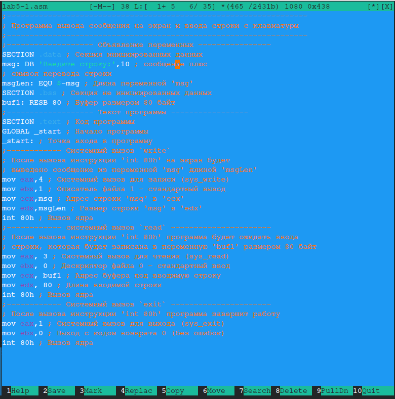{#fig:008 width=70%}

Скомпилируем и запустим созданную программу lab5-1.asm (рис. [-@fig:009]).

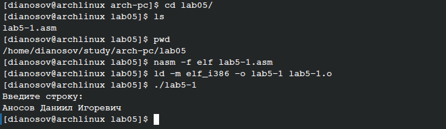{#fig:009 width=70%}

В одной из панелей mc откроем каталог с файлом lab5-1.asm. В другой панели каталог со скачанным файлом in_out.asm (рис. [-@fig:010]).

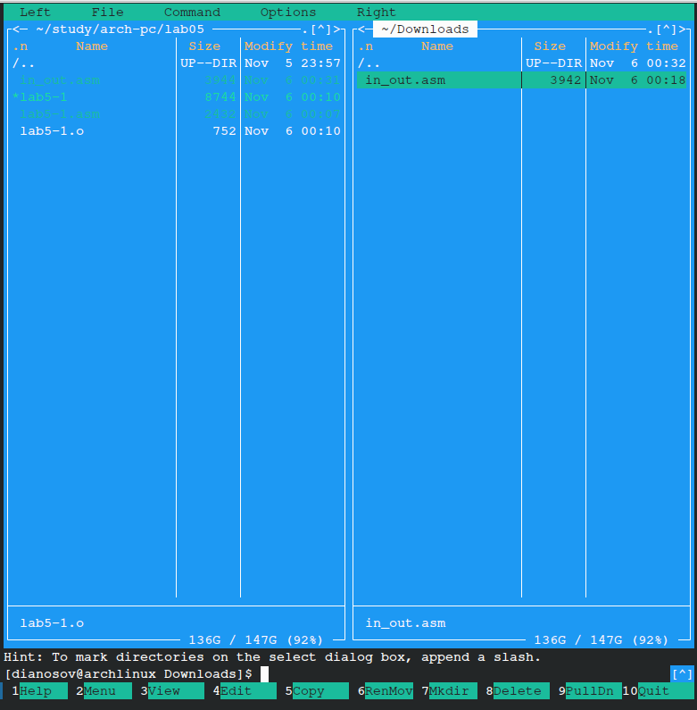{#fig:010 width=70%}

Скачаем и скопируем в текущую директорию файл in_out.asm с сайта ТУИС. (рис. [-@fig:011]).

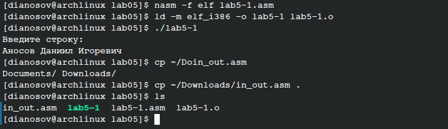{#fig:011 width=70%}

Скопируем первый файл с кодом и дадим новому файлу имя lab5-2.asm (рис. [-@fig:012]).

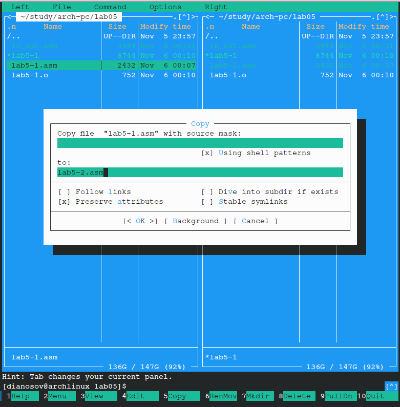{#fig:012 width=70%}

Отредактируем новый файл в соответствии с предложенным листингом. (рис. [-@fig:013]).

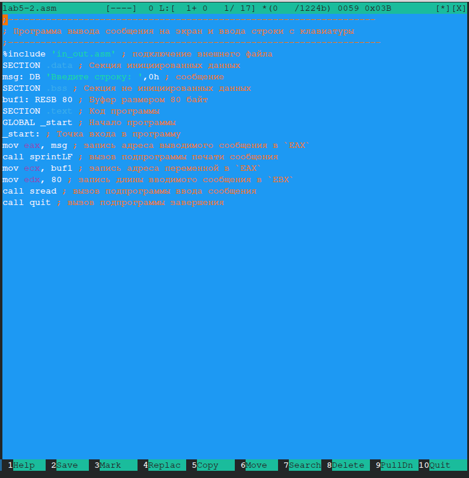{#fig:013 width=70%}

Проведем компиляцию нового отредактированного файла и проверим его работу. (рис. [-@fig:014]).

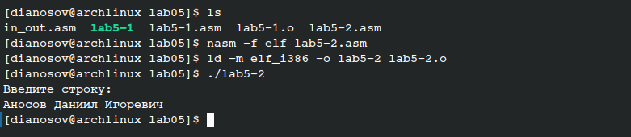{#fig:014 width=70%}

В новой программе поменяем команду **sprintLF** на **sprint**. (рис. [-@fig:015]).

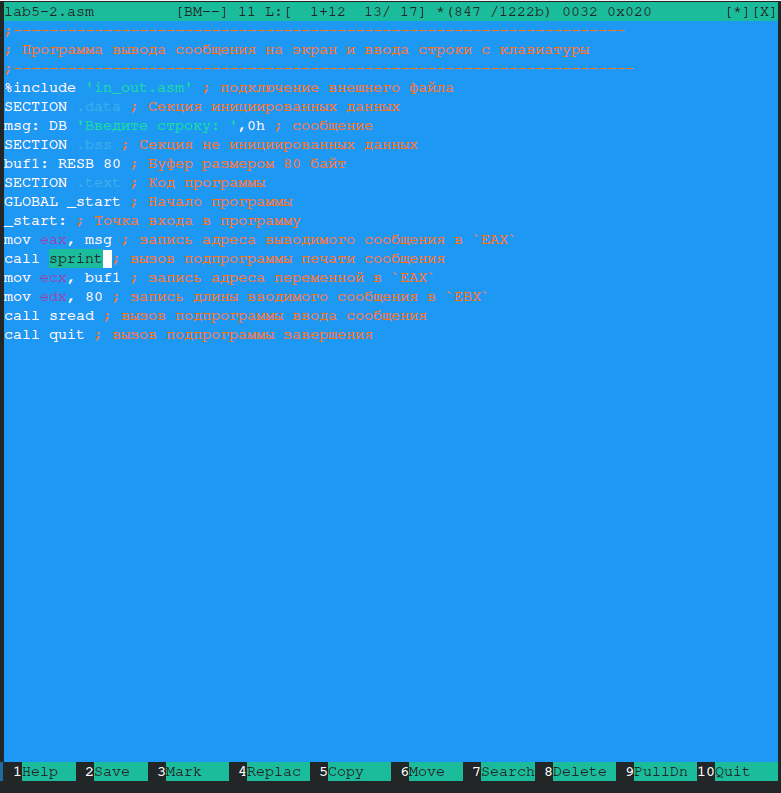{#fig:015 width=70%}

Проведем компиляцию нового отредактированного файла и проверим его работу, проанализировав, что изменилось. (рис. [-@fig:016]).

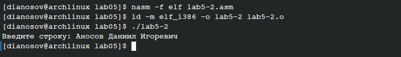{#fig:016 width=70%}

Как видно, команда **sprintLF** переводит строку после двоеточия, а команда **sprint** оставляет курсор на той же строке.

# Задание для самостоятельной работы

## Первая часть задания

Скопируем файл *lab5-1.asm* для дальнейшего редактирования. (рис. [-@fig:017]).

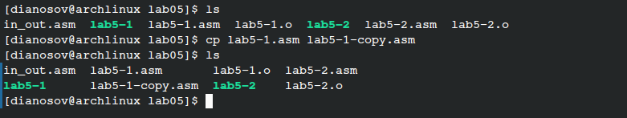{#fig:017 width=70%}

В коде добавим системный вызов *sys_write*, чтобы не только принимать строку от пользователя, но и выводить её после этого, как требуется в задании (код прокомментирован). (рис. [-@fig:018]).

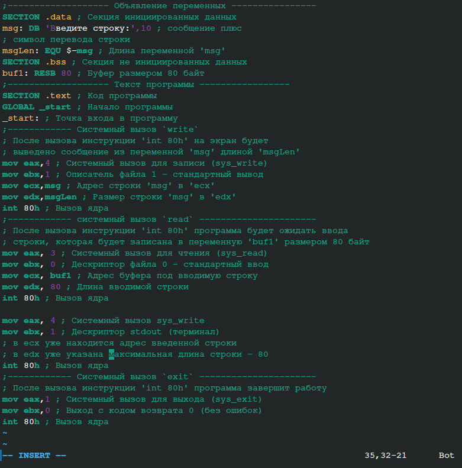{#fig:018 width=70%}

Скомпилируем новую версию программы и проверим работоспособность.
Как видно, введённая строка вывелась после того, как была введена в программу пользователем. Задание выполнено корректно. (рис. [-@fig:019]).

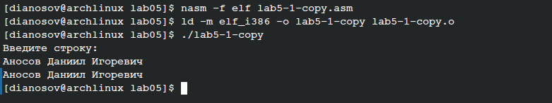{#fig:019 width=70%}

## Вторая часть задания

Скопируем файл *lab5-2.asm* для дальнейшего редактирования аналогично первой части задания, откроем его в редакторе *vim*. (рис. [-@fig:020]).
Требуется сделать так, чтобы программа выводила введённую пользователем строку, как и в первом задании. Но нужно использовать подключенный файл *in_out.asm*

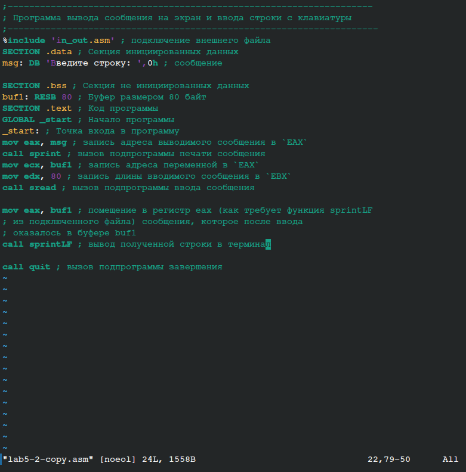{#fig:020 width=70%}

Скомпилируем новую версию программы и проверим работоспособность.
Как видно, введённая строка вывелась после того, как была введена в программу пользователем. Задание выполнено корректно. (рис. [-@fig:021]).
Отметим, что, поскольку была использована подпрограмма **sprintLF** из файла *in_out.asm*, после выведенной строки также появилась пустая строка. Это было оговорено ранее в отчёте.

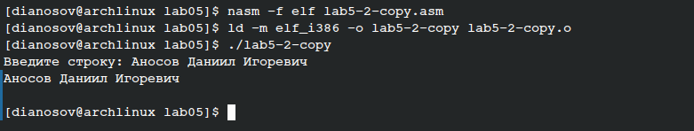{#fig:021 width=70%}

Все задания выполнены, загрузим же новую версию проекта курса на Github. (рис. [-@fig:022]).

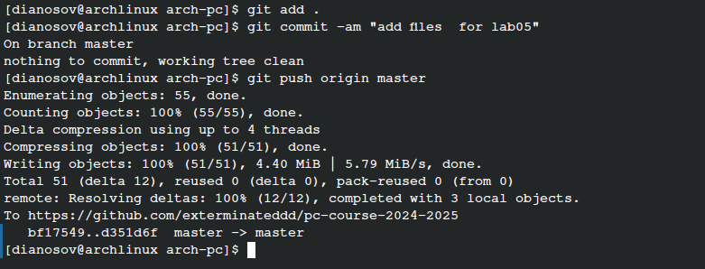{#fig:022 width=70%}

# Выводы

В ходе выполнения данной лабораторной работы были приобретены практические навыки работы в Midnight Commander. Освоены инструкции языка ассемблера mov и int.
