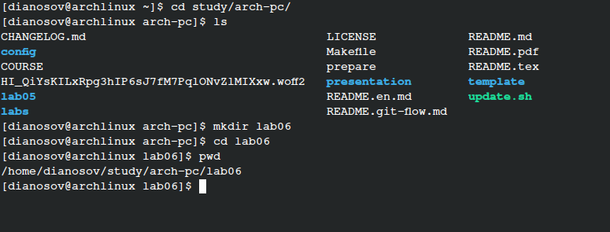
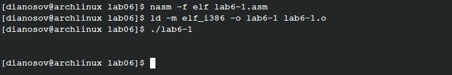
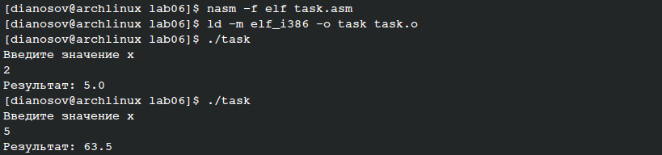

---
## Front matter
title: "Отчёт по лабораторной работе №6"
subtitle: "дисциплина: Архитектура компьютера"
author: "Аносов Даниил Игоревич"

## Generic otions
lang: ru-RU
toc-title: "Содержание"

## Bibliography
bibliography: bib/cite.bib
csl: pandoc/csl/gost-r-7-0-5-2008-numeric.csl

## Pdf output format
toc: true # Table of contents
toc-depth: 2
lof: true # List of figures
lot: true # List of tables
fontsize: 12pt
linestretch: 1.5
papersize: a4
documentclass: scrreprt
## I18n polyglossia
polyglossia-lang:
  name: russian
  options:
	- spelling=modern
	- babelshorthands=true
polyglossia-otherlangs:
  name: english
## I18n babel
babel-lang: russian
babel-otherlangs: english
## Fonts
mainfont: IBM Plex Serif
romanfont: IBM Plex Serif
sansfont: IBM Plex Sans
monofont: IBM Plex Mono
mathfont: STIX Two Math
mainfontoptions: Ligatures=Common,Ligatures=TeX,Scale=0.94
romanfontoptions: Ligatures=Common,Ligatures=TeX,Scale=0.94
sansfontoptions: Ligatures=Common,Ligatures=TeX,Scale=MatchLowercase,Scale=0.94
monofontoptions: Scale=MatchLowercase,Scale=0.94,FakeStretch=0.9
mathfontoptions:
## Biblatex
biblatex: true
biblio-style: "gost-numeric"
biblatexoptions:
  - parentracker=true
  - backend=biber
  - hyperref=auto
  - language=auto
  - autolang=other
  - citestyle=gost-numeric
## Pandoc-crossref LaTeX customization
figureTitle: "Рис."
tableTitle: "Таблица"
listingTitle: "Листинг"
lofTitle: "Список иллюстраций"
lotTitle: "Список таблиц"
lolTitle: "Листинги"
## Misc options
indent: true
header-includes:
  - \usepackage{indentfirst}
  - \usepackage{float} # keep figures where there are in the text
  - \floatplacement{figure}{H} # keep figures where there are in the text
---

# Цель работы

Освоение арифметических инструкций языка ассемблера NASM.

# Задание

1. Написать программу вычисления выражения $y$ = $f(x)$. Программа должна выводить выражение для вычисления, выводить запрос на ввод значения $x$, вычислять заданное выражение в зависимости от введенного, выводить результат вычислений. Вид функции $f(x)$ выбрать из таблицы 6.3 вариантов заданий в соответствии с номером полученным при выполнении лабораторной работы. Создайте исполняемый файл и проверьте его работу для значений $x_1$ и $x_2$ из 6.3.

# Выполнение лабораторной работы

Откроем терминал и создадим каталог для программ лабораторной работы №6 (рис. [-@fig:001]).

{#fig:001 width=85%}

Создадим файл *lab6-1.asm* и скопируем из каталога предыдущей лабораторной работы файл *in_out.asm* с полезными подпрограммами (рис. [-@fig:002]).

{#fig:002 width=85%}

## Вывод чисел в терминал в NASM

Скопируем код из предложенного листинга в файл *lab6-1.asm* (рис. [-@fig:003]).

> В данной программе в регистр eax записывается символ 6 (`mov eax, '6'`), в регистр *ebx* символ 4 (`mov ebx,'4'`). Далее к значению в регистре *eax* прибавляем значение регистра *ebx* (`add eax,ebx`, результат сложения запишется в регистр eax). Далее выводим результат. Так как для работы функции *sprintLF* в регистр eax должен быть записан адрес, необходимо использовать дополнительную переменную. Для этого запишем значение регистра *eax* в переменную *buf1* (`mov [buf1], eax`), а затем запишем адрес переменной *buf1* в регистр *eax* (`mov eax, buf1`) и вызовем функцию *sprintLF*.

{#fig:003 width=85%}

Скомпилируем и запустим программу *lab6-1.asm* (рис. [-@fig:004]).
В данном случае при выводе значения регистра *eax* мы ожидаем увидеть число 10. Однако результатом будет символ *j*. Это происходит потому, что код символа 6 равен 00110110 в двоичном представлении (или 54 в десятичном представлении), а код символа 4 – 00110100 (52). Команда `add eax,ebx` запишет в регистр *eax* сумму кодов – 01101010 (106), что в своюочередь является кодом символа *j*.

{#fig:004 width=85%}

Изменим текст программы и вместо символов запишем в регистры числа. Исправим текст программы следующим образом: заменим строки
```nasm
mov eax,'6'
mov ebx,'4'
```
на строки
```nasm
mov eax,6
mov ebx,4
```
Снова скомпилируем программу и запустим её (рис. [-@fig:005]).

{#fig:005 width=85%}

Как и в предыдущем случае при исполнении программы мы не получили число 10. В данном случае должен выводиться символ с кодом 10. Он не отображается в терминале.

В этом же каталоге создадим файл *lab6-1.asm*. В него вставим код из предложенного листинга, использующий команду *iprintLF* (рис. [-@fig:006]).

{#fig:006 width=85%}

Скомпилируем и запустим новую программу (рис. [-@fig:007]).
В результате работы программы мы получим число 106. В данном случае, как и в первом, команда add складывает коды символов ‘6’ и ‘4’ (54+52=106). Однако, в отличии от программы из листинга 6.1, функция *iprintLF* позволяет вывести число, а не символ, кодом которого является это число.

{#fig:007 width=85%}

Аналогично предыдущему примеру изменим символы на числа. Заменим строки
```nasm
mov eax,'6'
mov ebx,'4'
```
на строки
```nasm
mov eax,6
mov ebx,4
```
{#fig:008 width=85%}

Скомпилируем и запустим программу *lab6-2.asm* (рис. [-@fig:009]).
Отметим, что команда *iprintLF* не просто выводит число, а ещё и переводит строку после него. Команда *iprint*, напротив, только выводит значение из *eax*.

{#fig:009 width=85%}

## Арифметические операции в NASM
### Вычисление значения выражения
В качестве примера выполнения арифметических операций в NASM приведем программу вычисления арифметического выражения $f(x) = \frac{5*2+3}{3}$.

Создадим в рабочем каталоге файл *lab6-3.asm* и запишем в него код из предложенного листинга (рис. [-@fig:010]).

{#fig:010 width=85%}

Скомпилируем и запустим программу *lab6-3.asm* (рис. [-@fig:011]).

{#fig:011 width=85%}

Теперь сделаем так, чтобы программа вычисляла значение выражения $f(x) = \frac{4*6+2}{5}$.
Откроем файл с кодом в редакторе **Vim** и отредактируем код (рис. [-@fig:012]).

{#fig:012 width=85%}

Снова скомпилируем и запустим программу *lab6-3.asm* (рис. [-@fig:013]).

{#fig:013 width=85%}

Видим, что программа работает корректно. Действительно, $\frac{4*6+2}{5}=\frac{26}{5}=5 + \frac{1}{5}$.

### Программа вычисления номера варианта по номеру студенческого билета

В качестве другого примера рассмотрим программу вычисления варианта задания по
номеру студенческого билета, работающую по следующему алгоритму:
- вывести запрос на введение № студенческого билета
- вычислить номер варианта по формуле: $(S_n\mod 20) + 1$, где $S_n$ – номер студенческого билета.
- вывести на экран номер варианта.

Создадим в рабочем каталоге файл *variant.asm* (рис. [-@fig:014]).

{#fig:014 width=85%}

В новую программу введём код из предложенного листинга. (рис. [-@fig:015]).

{#fig:015 width=85%}

Проведем компиляцию нового файла и проверим его работу. (рис. [-@fig:016]).

{#fig:016 width=85%}

Программа верно вычисляет вариант. Действительно, $(1132243105 + 1)\%20=6$.
Ответы на вопросы:
1. Какие строки листинга 6.4 отвечают за вывод на экран сообщения ‘Ваш вариант:’?
За это отвечают строки:
```nasm
mov eax, msg
call sprintLF
```
2. Для чего используется следующие инструкции?
```nasm
mov ecx, x
mov edx, 80
call sread
```
Они отвечают за считывание ввода из терминала.
Первая строчка говорит, что считанное значение будет помещено в `x`.
Вторая строчка задает максимальный объём данных для считывания.
Третья - вызывает функцию *sread* считывания строки из терминала.

3. Для чего используется инструкция “`call atoi`”?

Для преобразования значения в регистре `eax` в число.

4. Какие строки листинга 6.4 отвечают за вычисления варианта?
```nasm
mov ebx,20
div ebx
inc edx
```

5. В какой регистр записывается остаток от деления при выполнении инструкции “`div
ebx`”?

Остаток от деления помещается в регистр `edx`.

6. Для чего используется инструкция “`inc edx`”?

Эта инструкция используется для увеличения значения в регистре `edx` на 1.

7. Какие строки листинга 6.4 отвечают за вывод на экран результата вычислений?
```nasm
mov eax,rem
call sprint
mov eax,edx
call iprintLF
```

# Задание для самостоятельной работы

Полученный номер варианта - 6, как указано ранее. Выражение: $f(x)=\frac{x^3}{2}+1$

Скопируем файл `lab6-3.asm` и дадим новому файлу название `task.asm`. (рис. [-@fig:017]).
В новом файле сделаем нужные изменения (код прокомментирован).

{#fig:017 width=85%}

Проверим коррекность работы программмы для $x_1=2,x_2=5$ (рис. [-@fig:018]).

{#fig:018 width=90%}
Программа работает правильно.

Ниже приведен весь код новой программы с подробными комментариями.
```nasm
%include 'in_out.asm' ; подключение внешнего файла
SECTION .data
msg: DB 'Введите значение x',0
div: DB 'Результат: ',0
dot: DB '.',0
SECTION .bss
x: RESB 80    ; резервируем память под значение x
SECTION .text
GLOBAL _start
_start:
mov eax, msg
call sprintLF ; вывод приглашения к вводу
mov ecx, x
mov edx, 80
call sread ; считывание значения x
mov eax, x ; eax = x
call atoi ; преобразуем eax в число
mov edi, eax
mul edi   ; умножаем eax на edi=x, eax = x^2
mul edi   ; eax = x^3
mov ebx,2 ; ebx = 2
xor edx, edx ; обнуляем edx
div ebx   ; делим eax на ebx, eax = eax//2
; остаток от деления помещается в edx
inc eax ; eax = x^3/2 + 1
mov edi, eax ; результат кладём в edi
mov eax, edx ; остаток от деления перемещаем в eax
mov ecx,10
mul ecx  ; умножаем eax на 10
div ebx ; делим eax на 2
mov edx, eax
; теперь в edx имеем дробную (десятичную) форму остатка
; в edi целая часть частного
; выводить будем [целая часть].[дробная часть]
mov eax,div ; вызов подпрограммы печати
call sprint ; сообщения 'Результат: '
mov eax,edi ; вызов подпрограммы печати значения
call iprint ; из 'edi' в виде символов
mov eax,dot ; точка
call sprint ; печать точки
mov eax,edx ; вызов подпрограммы печати значения
call iprintLF ; из 'edx' (остаток) в виде символов
call quit ; вызов подпрограммы завершения
```

Задание выполнено, загрузим новую версию проекта курса на GitHub.
{#fig:019 width=85%}


# Выводы

В ходе выполнения лабораторной работы были освоены арифметические инструкции языка ассемблера NASM.
