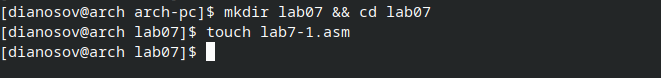

---
## Front matter
title: "Отчёт по лабораторной работе №7"
subtitle: "дисциплина: Архитектура компьютера"
author: "Аносов Даниил Игоревич"

## Generic otions
lang: ru-RU
toc-title: "Содержание"

## Bibliography
bibliography: bib/cite.bib
csl: pandoc/csl/gost-r-7-0-5-2008-numeric.csl

## Pdf output format
toc: true # Table of contents
toc-depth: 2
lof: true # List of figures
lot: true # List of tables
fontsize: 12pt
linestretch: 1.5
papersize: a4
documentclass: scrreprt
## I18n polyglossia
polyglossia-lang:
  name: russian
  options:
	- spelling=modern
	- babelshorthands=true
polyglossia-otherlangs:
  name: english
## I18n babel
babel-lang: russian
babel-otherlangs: english
## Fonts
mainfont: IBM Plex Serif
romanfont: IBM Plex Serif
sansfont: IBM Plex Sans
monofont: IBM Plex Mono
mathfont: STIX Two Math
mainfontoptions: Ligatures=Common,Ligatures=TeX,Scale=0.94
romanfontoptions: Ligatures=Common,Ligatures=TeX,Scale=0.94
sansfontoptions: Ligatures=Common,Ligatures=TeX,Scale=MatchLowercase,Scale=0.94
monofontoptions: Scale=MatchLowercase,Scale=0.94,FakeStretch=0.9
mathfontoptions:
## Biblatex
biblatex: true
biblio-style: "gost-numeric"
biblatexoptions:
  - parentracker=true
  - backend=biber
  - hyperref=auto
  - language=auto
  - autolang=other
  - citestyle=gost-numeric
## Pandoc-crossref LaTeX customization
figureTitle: "Рис."
tableTitle: "Таблица"
listingTitle: "Листинг"
lofTitle: "Список иллюстраций"
lotTitle: "Список таблиц"
lolTitle: "Листинги"
## Misc options
indent: true
header-includes:
  - \usepackage{indentfirst}
  - \usepackage{float} # keep figures where there are in the text
  - \floatplacement{figure}{H} # keep figures where there are in the text
---

# Цель работы

Изучение команд условного и безусловного переходов. Приобретение навыков написания программ с использованием переходов. Знакомство с назначением и структурой файла листинга.

# Задание

1. Напишите программу нахождения наименьшей из 3 целочисленных переменных $a, b$ и $c$.
Значения переменных выбрать из табл. 7.5 в соответствии с вариантом, полученным при выполнении лабораторной работы № 6. Создайте исполняемый файл и проверьте его работу.
2. Напишите программу, которая для введенных с клавиатуры значений $x$ и $a$ вычисляет
значение заданной функции $f(x)$ и выводит результат вычислений. Вид функции $f(x)$ выбрать из таблицы 7.6 вариантов заданий в соответствии с вариантом, полученным при выполнении лабораторной работы № 6. Создайте исполняемый файл и проверьте
его работу для значений $x$ и $a$ из 7.6.

# Выполнение лабораторной работы

## Реализация переходов в NASM

Откроем терминал и создадим каталог для программ лабораторной работы №7. В новом каталоге создадим файл для первой программы *lab7-1.asm*. (рис. [-@fig:001]).

{#fig:001 width=85%}

Введём в этот файл текст программы из предложенного листинга. (рис. [-@fig:002]).

{#fig:002 width=85%}

Скомпилируем и запустим программу, предварительно скопировав из каталога предыдущей лабораторной работы вспомогательный файл с подпрограммами *in_out.asm* (рис. [-@fig:003]).


{#fig:003 width=85%}

>Таким образом, использование инструкции `jmp _label2` меняет порядок исполнения
инструкций и позволяет выполнить инструкции начиная с метки `_label2`, пропустив вывод
первого сообщения.
Инструкция `jmp` позволяет осуществлять переходы не только вперед но и назад. Изменим
программу таким образом, чтобы она выводила сначала ‘Сообщение № 2’, потом ‘Сообщение
№ 1’ и завершала работу. Для этого в текст программы после вывода сообщения № 2 добавим
инструкцию `jmp` с меткой `_label1` (т.е. переход к инструкциям вывода сообщения № 1)
и после вывода сообщения № 1 добавим инструкцию `jmp` с меткой `_end` (т.е. переход к
>инструкции `call quit`). 

Изменим текст программы в соответствии с листингом 7.2  (рис. [-@fig:004]).


{#fig:004 width=85%}

Скомпилируем и запустим программу. (рис. [-@fig:005]).

{#fig:005 width=85%}

Теперь изменим программу так, чтобы сообщения выводились в порядке 3,2,1. (рис. [-@fig:006]).

{#fig:006 width=85%}

Сохраним, скомпилируем и запустим новую программу. (рис. [-@fig:007]).

{#fig:007 width=85%}

Как видно, программа работает корректно.

>Использование инструкции `jmp` приводит к переходу в любом случае. Однако, часто при
написании программ необходимо использовать условные переходы, т.е. переход должен происходить если выполнено какое-либо условие. В качестве примера рассмотрим
программу, которая определяет и выводит на экран наибольшую из 3 целочисленных
переменных: A, B и C. Значения для A и C задаются в программе, значение B вводится с
клавиатуры.

Текст новой программы, взятый из листинга, введем в новый файл *lab7-2.asm*

{#fig:008 width=85%}

Создадим исполняемый файл и проверим работу программы. (рис. [-@fig:009]).

{#fig:009 width=85%}

Обратим внимание, в данном примере переменные A и С сравниваются как символы, а переменная B и максимум из A и С как числа (для этого используется функция atoi преобразования символа в число). Это сделано для демонстрации того, как сравниваются данные.
Данную программу можно упростить и сравнивать все 3 переменные как символы (т.е. не
использовать функцию atoi). Однако если переменные преобразовать из символов числа,
над ними можно корректно проводить арифметические операции.

## Изучение структуры файлы листинга

Обычно nasm создаёт в результате ассемблирования только объектный файл. Получить
файл листинга можно, указав ключ `-l` и задав имя файла листинга в командной строке.
Создадим файл листинга для программы из файла *lab7-2.asm*. (рис. [-@fig:010]).
Будем использовать команду:
```
nasm -f elf -l lab7-2.lst lab7-2.asm
```

{#fig:010 width=85%}

Откроем файл листинга в редакторе **Vim** и обратим внимание на строки 45-47. (рис. [-@fig:011]).

```nasm
    45 00000159 B8[13000000]            mov eax, msg2
    46 0000015E E8ACFEFFFF              call sprint ; Вывод сообщения 'Наибольшее число: '
    47 00000163 A1[00000000]            mov eax,[max]
```
Машинные коды в строках 45 и 47 имеют в конце значения в квадратных скобках, так как они соответствуют вызовам инструкций с двумя операндами. Строка 46 же отвечает вызову функции `sprint`, поэтому её машинный код (E8ACFEFFFF) - это единая строка.
Итого, машинный код, отвечающий инструкции с одним операндом - это слитная строка, а если операндов больше, чем один - то машинный код будет содержать часть в квадратных скобках.

{#fig:011 width=85%}

# Задание для самостоятельной работы
## Нахождение наименьшего из трёх чисел
### Введение
Напишем программу, которая находит наименьшее из трёх введённых пользователем чисел.
Для этого воспользуемся кодом программы из предыдущих примеров, и изменим его должным образом.
Скопируем файл *lab7-2.asm* и дадим новой программе имя *task1.asm*.
 (рис. [-@fig:012], [-@fig:013]).

{#fig:012 width=85%}

{#fig:013 width=85%}

### Алгоритм работы программы. Тестирование
Алгоритм работы программы: сравниваем `A` и `B`, минимальное из них кладём в переменную `min`. Сравниваем `min` с `C`. Минимальное из них - минимальное из всех чисел - результат работы программы.
Пример на рис. [-@fig:014].
Скомпилируем и запустим новую программу.

{#fig:014 width=85%}

Тестовый запуск был проведён со значениями 79, 83, 41, соответствующими варианту №6, полученному в предыдущей лабораторной работе.

### Исходный код программы
Исходный текст *task1.asm* приведён ниже.
```nasm
%include 'in_out.asm'
section .data

msga db 'Введите A: ',0h
msgb db 'Введите B: ',0h
msgc db 'Введите C: ',0h
msg1 db "Наименьшее число: ",0h
section .bss
min resb 10
A resb 10 ; резервируем место не
B resb 10 ; только под B,
C resb 10 ; но и под A и C
section .text
global _start
_start:
; ---------- Ввод A, B, C
mov eax,msga
call sprint
mov ecx,A
mov edx, 10
call sread
mov eax,msgb
call sprint
mov ecx,B
call sread
mov eax,msgc
call sprint
mov ecx,C
call sread
; ---------- Преобразование A,B,C из символов в числа
mov eax,A
call atoi ; Вызов подпрограммы перевода символа в число
mov [A],eax ; запись преобразованного числа в 'A'
mov eax,B
call atoi
mov [B],eax
mov eax,C
call atoi
mov [C],eax
; ---------- Записываем A+B+C в переменную 'min'
; сумма значений точно больше каждого из них
mov ecx,[A]
add ecx,[B]
add ecx,[C]
mov [min],ecx

jmp cmp_a_b ; к сравнению AvB

min_below_c:
jmp fin

c_below_min:
mov eax,[C]
mov [min],eax
jmp fin

a_below_b:
mov eax,[A]
mov [min],eax   ; min(A, B) = A
jmp cmp_min_c   ; к сравнению min v C

b_below_a:
mov eax,[B]
mov [min],eax   ; min(A, B) = B
jmp cmp_min_c   ; к сравнению min v C

cmp_min_c:      ; min(A, B)vC
mov eax,[C]
cmp [min],eax
jb min_below_c  ; min(A, B)<C
jg c_below_min  ; min(A, B)>C

cmp_a_b:        ; AvB
mov eax,[B]
cmp [A],eax
jb a_below_b    ; A<B
jg b_below_a    ; A>B

; ---------- Вывод результата
fin:
mov eax, msg1
call sprint ; Вывод сообщения 'Наименьшее число: '
mov eax,[min]
call iprintLF ; Вывод 'min(A,B,C)'
call quit ; Выход
```

## Вычисление значения функции
### Введение
Требуется написать программу, вычисляющую значение функции в зависимости от значений $x, a$.
Я получил вариант №6 в процессе выполнений заданий предыдущей лабораторной работы. Этому варианту соответствует следующая функция:
$f(x)=\begin{cases}
      x+a, &  x=a \\
      5x, & x\ne a
    \end{cases}$
$(x_1, a_1) = (2,2),\ (x_2, a_2) = (2,1)$

Для написания программы создадим файл *task2.asm*, откроем его в редакторе **Vim**. (рис. [-@fig:015]).

{#fig:015 width=85%}

### Алгоритм работы программы. Тестирование

Программа работает по следующей логике:
Сравниваем значения $a$ и $x$. Если $a=x$, то переходим к метке `a_equals_x`. В этой части программы приравниваем результат к $x$ и прибавляем $a$ к нему, а затем переходим к метке завершения `fin`. Иначе, если значения не равны, переходим к метке `a_nequals_x`: приравниваем результат к $x$, умножаем его на $5$ и переходим к завершению (`fin`).
Под меткой `fin` выводим сообщение с результатом и вызываем сигнал прерывания.

Фрагмент когда приведён на рис. [-@fig:016].

{#fig:016 width=85%}

Проверим работу программы для входных данных $(x_1, a_1) = (2,2),\ (x_2, a_2) = (2,1)$ (рис. [-@fig:017]).

{#fig:017 width=85%}

Как видим, программа работает корректно.

### Исходный код программы
Исходный код программы *task2.asm* приведён ниже.
```nasm
%include 'in_out.asm'
section .data
msgx db 'Введите x: ',0h
msga db 'Введите a: ',0h
msg1 db "Результат: ",0h

section .bss
x resb 10 ; резервируем место под x
a resb 10 ; под а
res resb 10 ; и под результат

section .text
global _start
_start:
; ------ Ввод значений х, а
mov eax,msgx
call sprint
mov ecx,x
mov edx,10
call sread
mov eax,msga
call sprint
mov ecx,a
call sread
; ------ Преобразование х, а в числа
mov eax,x
call atoi ; вызов подпрограммы перевода символа в число
mov [x],eax ; запись преобразованного числа в 'x'
mov eax,a
call atoi
mov [a],eax
; ------ Логическая часть программы
mov eax, [a]
mov ebx, [x]
cmp ebx, eax ; сравнение а и х
je a_equals_x
jne a_nequals_x

a_equals_x:
mov ecx, [x]
mov [res], ecx ; ecx := x
mov ecx, [a]
add [res], ecx ; res := res + a = x + a
jmp fin

a_nequals_x:
mov ecx, [x]
mov [res], ecx ; res := x
mov ecx, 5
mov eax, [res] ; eax := res
mul ecx        ; eax := res * 5 = 5x
mov [res], eax ; res := eax = 5x
jmp fin

fin:
mov eax, msg1
call sprint ; Вывод сообщения 'Результат: '
mov eax,[res]
call iprintLF ; Вывод res
call quit ; Выход
```

Задание выполнено, загрузим новую версию проекта курса на GitHub.
{#fig:018 width=85%}


# Выводы

В ходе выполнения лабораторной работы были изучены команды условного и безусловного переходов. Приобретены навыки написания программ с использованием переходов.
