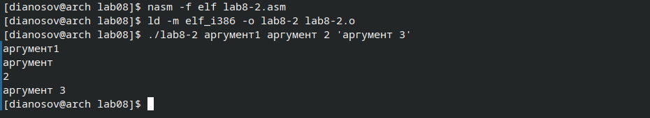

---
## Front matter
title: "Отчёт по лабораторной работе №8"
subtitle: "дисциплина: Архитектура компьютера"
author: "Аносов Даниил Игоревич"

## Generic otions
lang: ru-RU
toc-title: "Содержание"

## Bibliography
bibliography: bib/cite.bib
csl: pandoc/csl/gost-r-7-0-5-2008-numeric.csl

## Pdf output format
toc: true # Table of contents
toc-depth: 2
lof: true # List of figures
lot: true # List of tables
fontsize: 12pt
linestretch: 1.5
papersize: a4
documentclass: scrreprt
## I18n polyglossia
polyglossia-lang:
  name: russian
  options:
	- spelling=modern
	- babelshorthands=true
polyglossia-otherlangs:
  name: english
## I18n babel
babel-lang: russian
babel-otherlangs: english
## Fonts
mainfont: IBM Plex Serif
romanfont: IBM Plex Serif
sansfont: IBM Plex Sans
monofont: IBM Plex Mono
mathfont: STIX Two Math
mainfontoptions: Ligatures=Common,Ligatures=TeX,Scale=0.94
romanfontoptions: Ligatures=Common,Ligatures=TeX,Scale=0.94
sansfontoptions: Ligatures=Common,Ligatures=TeX,Scale=MatchLowercase,Scale=0.94
monofontoptions: Scale=MatchLowercase,Scale=0.94,FakeStretch=0.9
mathfontoptions:
## Biblatex
biblatex: true
biblio-style: "gost-numeric"
biblatexoptions:
  - parentracker=true
  - backend=biber
  - hyperref=auto
  - language=auto
  - autolang=other
  - citestyle=gost-numeric
## Pandoc-crossref LaTeX customization
figureTitle: "Рис."
tableTitle: "Таблица"
listingTitle: "Листинг"
lofTitle: "Список иллюстраций"
lotTitle: "Список таблиц"
lolTitle: "Листинги"
## Misc options
indent: true
header-includes:
  - \usepackage{indentfirst}
  - \usepackage{float} # keep figures where there are in the text
  - \floatplacement{figure}{H} # keep figures where there are in the text
---

# Цель работы

Приобретение навыков написания программ с использованием циклов и обработкой аргументов командной строки.

# Задание

1. Напишите программу, которая находит сумму значений функции $f(x)$ для
$x = x_1, x_2, \dots, x_n$, т.е. программа должна выводить значение $f(x_1) + f(x_2) + \dots + f(x_n)$.
Значения $x_i$ передаются как аргументы. Вид функции $f(x)$ выбрать из таблицы
8.1 вариантов заданий в соответствии с вариантом, полученным при выполнении
лабораторной работы № 6. Создайте исполняемый файл и проверьте его работу на
нескольких наборах $x = x_1, x_2, \dots, x_n$.

# Выполнение лабораторной работы

## Реализация циклов в NASM

Откроем терминал и создадим каталог для программ лабораторной работы №8. В новом каталоге создадим файл для первой программы *lab8-1.asm*. (рис. [-@fig:001]).

{#fig:001 width=85%}

Введём в этот файл текст программы из предложенного листинга. (рис. [-@fig:002]).

{#fig:002 width=85%}

Скомпилируем и запустим программу, предварительно скопировав из каталога предыдущей лабораторной работы вспомогательный файл с подпрограммами *in_out.asm* (рис. [-@fig:003]).

{#fig:003 width=85%}


Изменим текст программы, добавив изменение значения регистра ecx в цикле (рис. [-@fig:004]).

```nasm
label:
sub ecx,1 ; `ecx=ecx-1`
mov [N],ecx
mov eax,[N]
call iprintLF
loop label
```

{#fig:004 width=85%}

Скомпилируем и запустим измененную программу. Проверим её работу. (рис. [-@fig:005]).

{#fig:005 width=85%}

>Какие значения принимает регистр `ecx` в цикле? 
>Соответствует ли число проходов цикла значению $N$, введенному с клавиатуры?

Регистр `ecx` принимает значения с шагом 2, начиная с $N-1$. Поэтому, число проходов цикла равно $\lfloor{\frac{N}{2}}\rfloor$, что меньше $N$.

Для использования регистра `ecx` в цикле и сохранения корректности работы программы
можно использовать стек. Внесём изменения в текст программы, добавив команды `push`
и `pop` (добавления в стек и извлечения из стека) для сохранения значения счетчика цикла
`loop`:
```nasm
label:
push ecx ; добавление значения ecx в стек
sub ecx,1
mov [N],ecx
mov eax,[N]
call iprintLF
pop ecx ; извлечение значения ecx из стека
loop label
```

Откроем файл программы в **Vim** и отредактируем код (рис. [-@fig:006]).

{#fig:006 width=85%}

Проведём компиляцию программы с изменениями, проверим, как она работает (рис. [-@fig:007]).

{#fig:007 width=85%}

Теперь, после того, как мы начали сохранять значения итератора `ecx` в стек, цикл стал работать корректно. Количество проходов цикла соответствует введённому $N$.

## Обработка аргументов командной строки

При разработке программ иногда встает необходимость указывать аргументы, которые
будут использоваться в программе, непосредственно из командной строки при запуске
программы.
В качестве примера такой программы рассмотрим программу, предложенную в листинге.
Создадим для неё новый файл *lab8-2.asm* и откроем его в редакторе **Vim**.

{#fig:008 width=85%}

Требуется проверить работу программы. Скомпилируем её и запустим исполняемый файл, указав аргументы в командной строке (рис. [-@fig:009]).
```bash
./lab8-2 аргумент1 аргумент 2 'аргумент 3'
```

{#fig:009 width=85%}

Программа обработала не 3 аргумента, а 4, так как слова, разделённые пробелом, написанные без кавычек (`аргумент 2`) обрабатываются как отдельные.

### Вычисление суммы аргументов

Теперь создадим новый файл под названием *lab8-3.asm*. Введём в него код программы, вычисляющей сумму аргументов, переданных в командной строке.
Файл откроем редактором **Vim** (рис. [-@fig:010]).


{#fig:010 width=85%}
 
Теперь скомпилируем программу и проверим её работу (рис. [-@fig:011]).


{#fig:011 width=85%}

### Вычисление произведения аргументов

Теперь изменим код так, чтобы программа выводила не сумму, а произведение аргументов командной строки.
Для этого вместо
```nasm
pop eax
call atoi
add esi, eax
```
напишем
```nasm
pop eax        ; eax := следующий аргумент
call atoi
mov ebx, eax   ; ebx := eax
mov eax, esi   ; eax := esi
mul ebx        ; eax := eax * ebx
mov esi, eax   ; esi := eax = eax * ebx = esi * ebx
```

Также, изменим изначальное значенике `esi` с 0 на 1 (нейтральный элемент по умножению, а не по сложению).

Сделаем изменения в файле программы и скомплируем его. Проверим работу. (рис. [-@fig:012], [-@fig:013]).

{#fig:012 width=85%}

{#fig:013 width=85%}

Как видно, программа правильно выводит произведение переданных в командной строке аргументов.


# Задание для самостоятельной работы

Для начала, нужно выбрать вид функции $f(x)$ из таблицы. Варианту №6 соответствует функция $\\f(x) = 4x-3$

Создадим для выполнения задания файл *task.asm*, откроем его в редакторе **Vim** (рис. [-@fig:014])

{#fig:014 width=85%}

Программа аналогична одной из уже рассмотренных в этой лабораторной работе. Теперь она суммирует (прибавляет к регистру `esi`) не сами аргументы ($x_i$), а значения функции, соответствующие им: $f(x_i)$.

Протестируем работу программы (рис. [-@fig:015]).

{#fig:015 width=85%}

Выводится верный результат: 
$f(1)+f(2)+f(3)+f(4)=\\=4\times1-3+4\times2-3+4\times3-3+4\times4-3=\\=40-12=28$

Теперь сделаем так, чтобы программа выводила в начале строку $f(x)=4x-3$
Откроем программу в **Vim** и проведём необходимые изменения (рис. [-@fig:016]).
В секцию констант `.data` добавим нужное сообщение, а в самом начале секции `.text` выведем его, используя функцию `sprintLF`.

{#fig:016 width=85%}

Проверим же работу измененной программы (рис. [-@fig:017]).

{#fig:017 width=85%}

Программа работает корректно. Задание выполнено.

Загрузим файлы на GitHub (рис. [-@fig:018]).

{#fig:018 width=85%}


# Выводы

В ходе выполнения лабораторной работы были приобретены навыки написания программ с использованием циклов и обработкой аргументов командной строки.
