---
## Front matter
title: "Отчёт по лабораторной работе №9"
subtitle: "дисциплина: Архитектура компьютера"
author: "Аносов Даниил Игоревич"

## Generic otions
lang: ru-RU
toc-title: "Содержание"

## Bibliography
bibliography: bib/cite.bib
csl: pandoc/csl/gost-r-7-0-5-2008-numeric.csl

## Pdf output format
toc: true # Table of contents
toc-depth: 2
lof: true # List of figures
lot: true # List of tables
fontsize: 12pt
linestretch: 1.5
papersize: a4
documentclass: scrreprt
## I18n polyglossia
polyglossia-lang:
  name: russian
  options:
	- spelling=modern
	- babelshorthands=true
polyglossia-otherlangs:
  name: english
## I18n babel
babel-lang: russian
babel-otherlangs: english
## Fonts
mainfont: IBM Plex Serif
romanfont: IBM Plex Serif
sansfont: IBM Plex Sans
monofont: IBM Plex Mono
mathfont: STIX Two Math
mainfontoptions: Ligatures=Common,Ligatures=TeX,Scale=0.94
romanfontoptions: Ligatures=Common,Ligatures=TeX,Scale=0.94
sansfontoptions: Ligatures=Common,Ligatures=TeX,Scale=MatchLowercase,Scale=0.94
monofontoptions: Scale=MatchLowercase,Scale=0.94,FakeStretch=0.9
mathfontoptions:
## Biblatex
biblatex: true
biblio-style: "gost-numeric"
biblatexoptions:
  - parentracker=true
  - backend=biber
  - hyperref=auto
  - language=auto
  - autolang=other
  - citestyle=gost-numeric
## Pandoc-crossref LaTeX customization
figureTitle: "Рис."
tableTitle: "Таблица"
listingTitle: "Листинг"
lofTitle: "Список иллюстраций"
lotTitle: "Список таблиц"
lolTitle: "Листинги"
## Misc options
indent: true
header-includes:
  - \usepackage{indentfirst}
  - \usepackage{float} # keep figures where there are in the text
  - \floatplacement{figure}{H} # keep figures where there are in the text
---

# Цель работы

Приобретение навыков написания программ с использованием циклов и обработкой аргументов командной строки.

# Задание

1. Преобразуйте программу из лабораторной работы №8 (Задание №1 для самостоятель-
ной работы), реализовав вычисление значения функции $f(x)$ как подпрограмму.
2. В листинге 9.3 приведена программа вычисления выражения $(3 + 2) * 4 + 5$. При запуске
данная программа дает неверный результат. Проверьте это. С помощью отладчика GDB,
анализируя изменения значений регистров, определите ошибку и исправьте ее.

# Выполнение лабораторной работы

## Реализация подпрограмм в NASM

Откроем терминал и создадим каталог для программ лабораторной работы №8. В новом каталоге создадим файл для первой программы *lab9-1.asm*. (рис. [-@fig:001]).

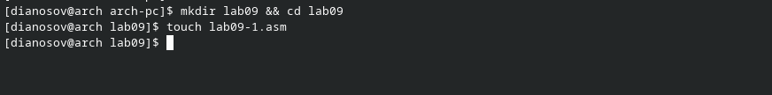{#fig:001 width=85%}

Введём в этот файл текст программы из предложенного листинга. (рис. [-@fig:002]).

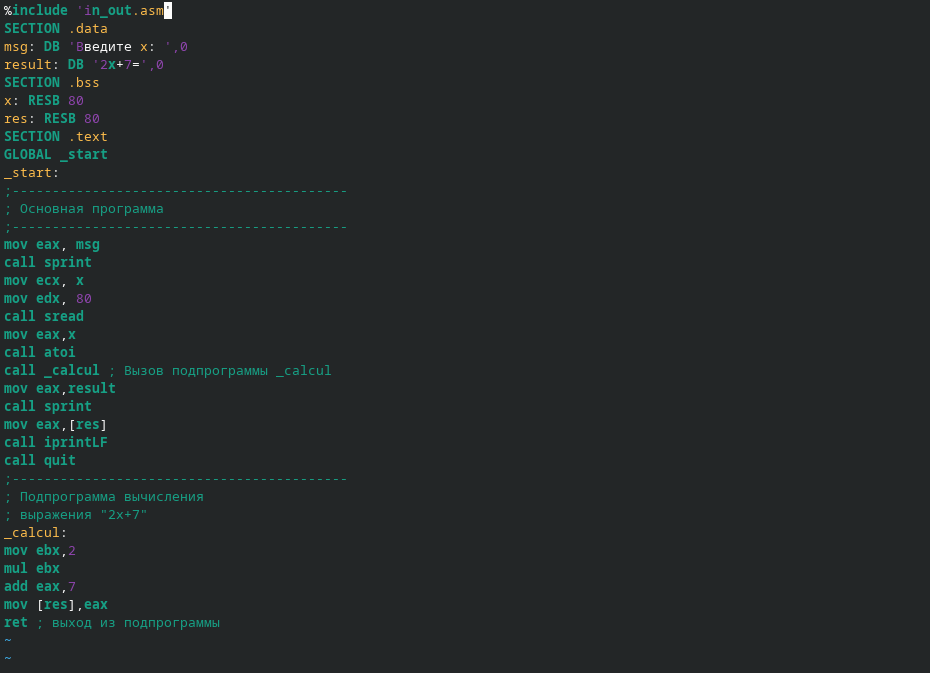{#fig:002 width=85%}

Первые строки программы отвечают за вывод сообщения на экран (`call sprint`), чтение
данных введенных с клавиатуры (`call sread`) и преобразования введенных данных из
символьного вида в численный (`call atoi`).

Скомпилируем и запустим программу, предварительно скопировав из каталога предыдущей лабораторной работы вспомогательный файл с подпрограммами *in_out.asm* (рис. [-@fig:003]).

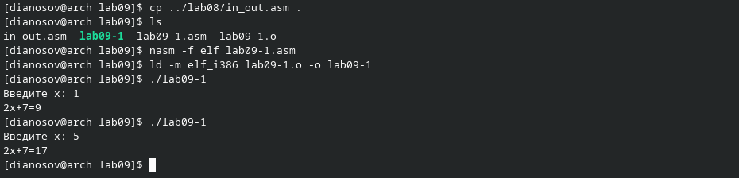{#fig:003 width=85%}


Изменим текст программы, добавив подпрограмму `_subcalcul` в подпрограмму `_calcul`,
для вычисления выражения $𝑓(𝑔(𝑥))$, где $𝑥$ вводится с клавиатуры, $𝑓(𝑥) = 2𝑥 + 7$, $𝑔(𝑥) =
3𝑥 − 1$. Т.е. $𝑥$ передается в подпрограмму `_calcul` из нее в подпрограмму `_subcalcul`, где
вычисляется выражение $𝑔(𝑥)$, результат возвращается в `_calcul` и вычисляется выражение
$𝑓(𝑔(𝑥))$. Результат возвращается в основную программу для вывода результата на экран. (рис. [-@fig:004]).

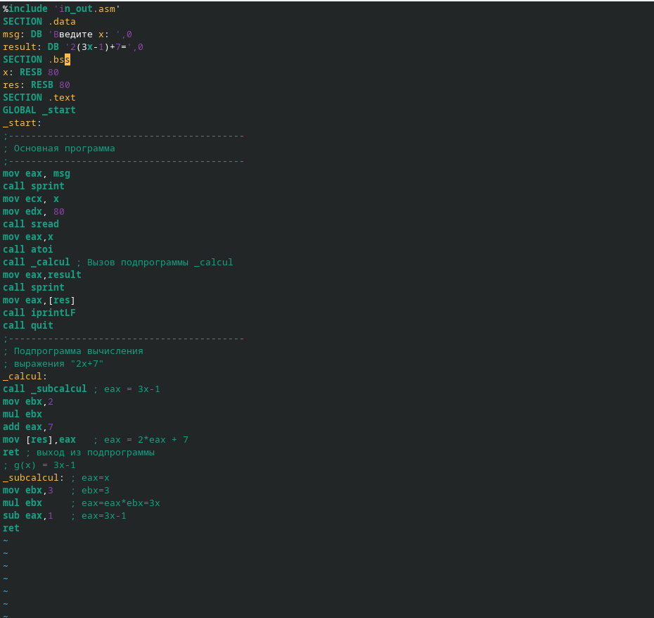{#fig:004 width=85%}

Скомпилируем и запустим измененную программу. Проверим её работу. (рис. [-@fig:005]).

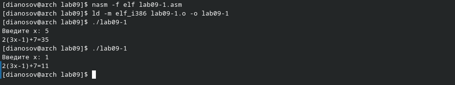{#fig:005 width=85%}

Теперь, после того, как мы добавили новую подпрограмму `_subcalcul`, программа корректно выполняет свою задачу.

Создадим новый файл *lab09-2.asm*. Введём в него код из предложенного листинга.

Откроем файл программы в **Vim** и отредактируем файл (рис. [-@fig:006]).

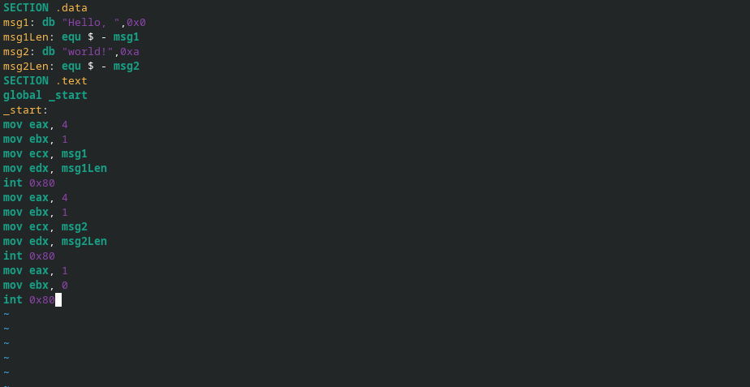{#fig:006 width=85%}

Проведём компиляцию новой программы, получим исполняемый файл (рис. [-@fig:007]).

## Отладка программам с помощью GDB

Для работы с GDB в исполняемый файл необходимо добавить отладочную информацию, для этого трансляцию программ необходимо проводить с ключом ‘-g’:
```
nasm -f elf -g -l lab09-2.lst lab09-2.asm
ld -m elf_i386 -o lab09-2 lab09-2.o
```


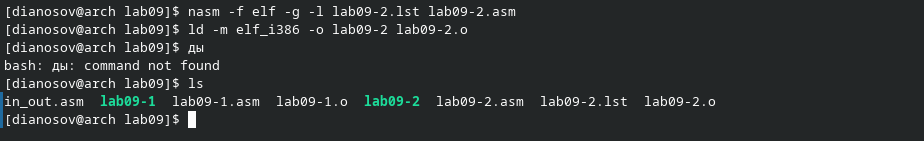{#fig:007 width=85%}

Откроем отладчик **GDB** (рис. [-@fig:008]).
В нём исследуем, как работают брейкпоинты (точки останова).

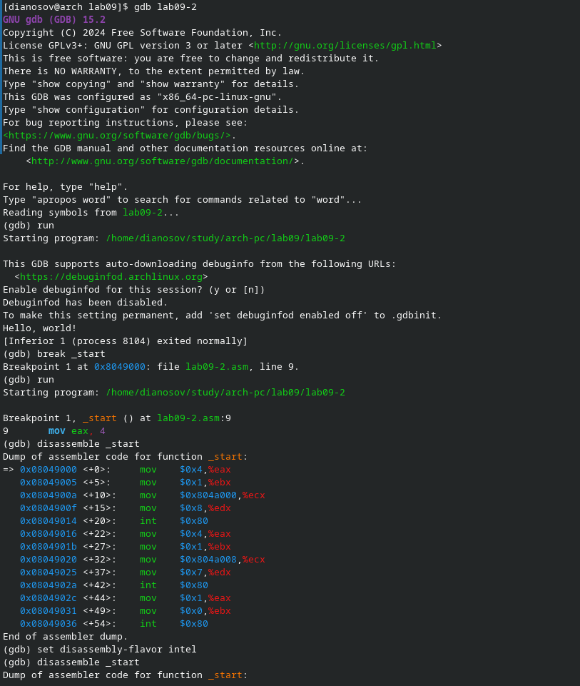{#fig:008 width=85%}

Переключимся на отображение команд с Intel’овским синтаксисом, введя команду `set disassembly-flavor intel` (рис. [-@fig:009]).
Этот режим отличается от режима *ATT* порядком операндов и стилем их обозначений, а именно, в *ATT* перед именами регистров стоят \$. Порядок операндов: в *ATT* "`source, destination`", а в *Intel* "`destination, source`".

{#fig:009 width=85%}

Теперь откроем режим псевдографики для более удобного анализа программы (рис. [-@fig:010]).

{#fig:010 width=85%}

### Добавление точек останова

Установить точку останова можно командой `break` (кратко `b`). Типичный аргумент этой
команды — место установки. Его можно задать или как номер строки программы (имеет
смысл, если есть исходный файл, а программа компилировалась с информацией об отладке),
или как имя метки, или как адрес. Чтобы не было путаницы с номерами, перед адресом
ставится «звёздочка»:
На предыдущих шагах была установлена точка останова по имени метки (`_start`). Про-
верим это с помощью команды info breakpoints (кратко `i b`).
Установим еще одну точку останова по адресу инструкции. Адрес инструкции можно
увидеть в средней части экрана в левом столбце соответствующей инструкции (см. рис. 9.3).
Определим адрес предпоследней инструкции (`mov ebx,0x0`) и установим точку останова (рис. [-@fig:011]).

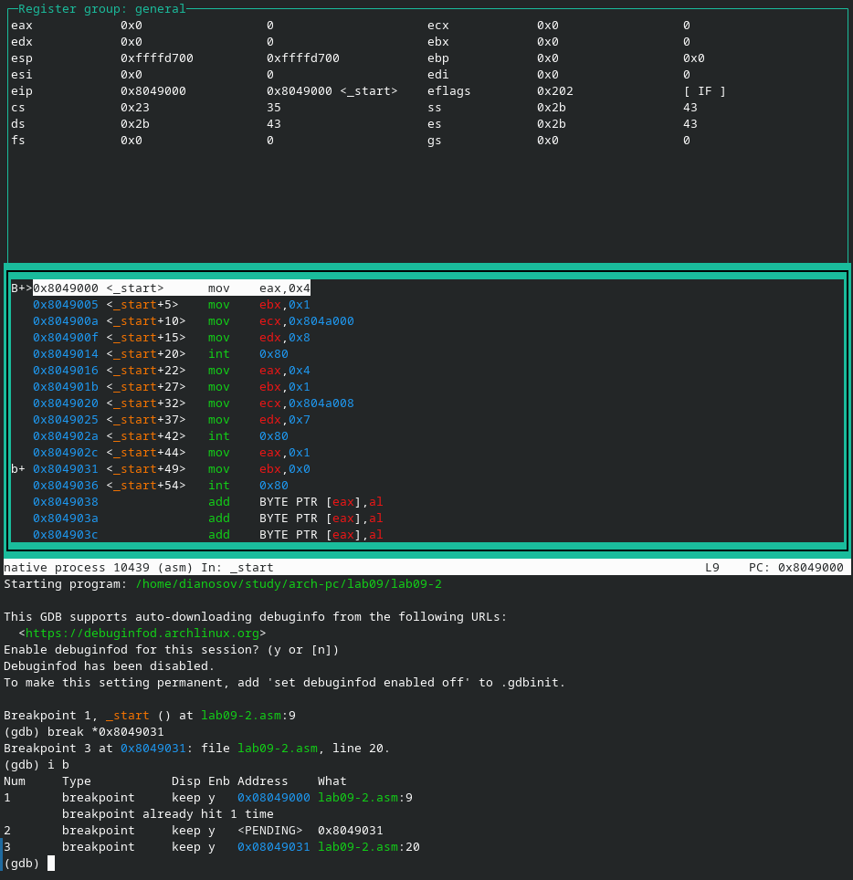{#fig:011 width=85%}

### Работа с данными программы в GDB

Отладчик может показывать содержимое ячеек памяти и регистров, а при необходимости позволяет вручную изменять значения регистров и переменных. Выполним 5 инструкций с помощью команды `stepi` (или `si`) и проследим за изменением значений регистров. Значения каких регистров изменяются?
Посмотреть содержимое регистров также можно с помощью команды `info registers` (или `i r`).
```
(gdb) info registers
```
Для отображения содержимого памяти можно использовать команду `x <адрес>`, которая
выдаёт содержимое ячейки памяти по указанному адресу. Формат, в котором выводятся
данные, можно задать после имени команды через косую черту: `x/NFU <адрес>`.
С помощью команды `x &<имя переменной>` также можно посмотреть содержимое переменной.
Посмотрите значение переменной `msg1` по имени 
```
(gdb) x/1sb &msg1
0x804a000 <msg1>: "Hello, "
```
Посмотрите значение переменной `msg2` по адресу. Адрес переменной можно определить
по дизассемблированной инструкции. Посмотрим инструкцию `mov ecx,msg2` которая записывает в регистр `ecx` адрес перемененной `msg2`.
(рис. [-@fig:012], [-@fig:013]).

{#fig:012 width=85%}

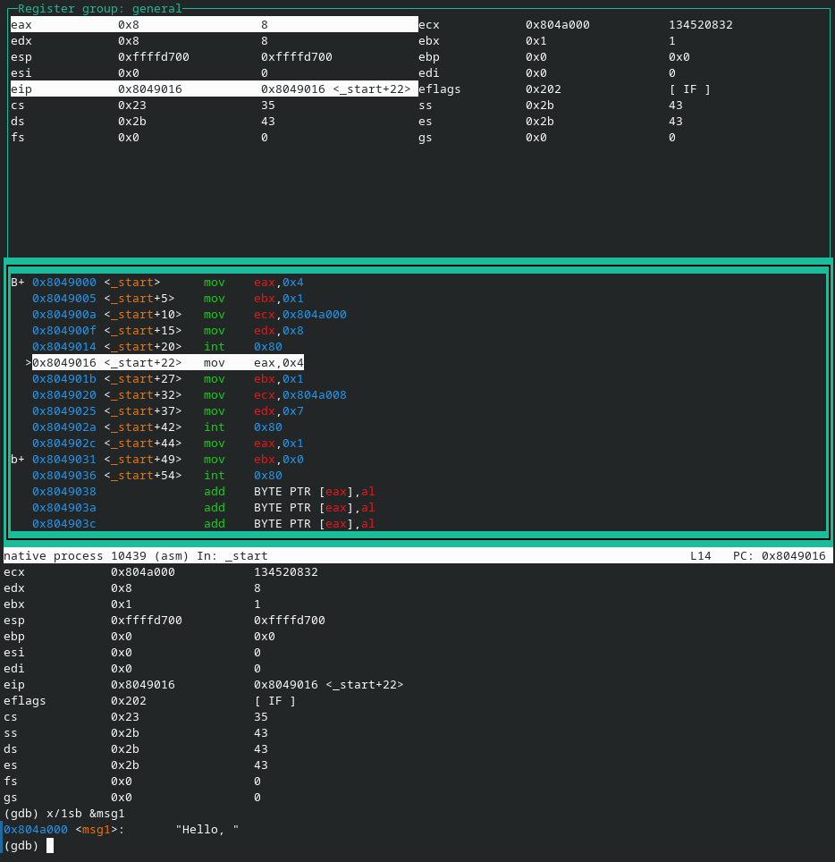{#fig:013 width=85%}

### Обработка аргументов командной строки в GDB

Скопируем файл `lab8-2.asm`, созданный при выполнении лабораторной работы №8,
с программой выводящей на экран аргументы командной строки в файл с
именем `lab09-3.asm`, создадим исполняемый файл (рис. [-@fig:014]).

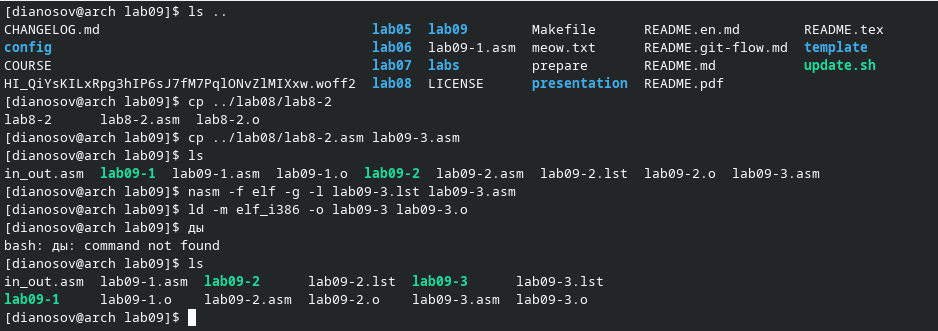{#fig:014 width=85%}

Для загрузки в `gdb` программы с аргументами необходимо использовать ключ `--args`.
Загрузим исполняемый файл в отладчик, указав аргументы (рис. [-@fig:015]):
```
gdb --args lab09-3 аргумент1 аргумент 2 'аргумент 3'
```

{#fig:015 width=85%}

Как видно, число аргументов равно 5 – это имя программы lab09-3 и непосредственно
аргументы: аргумент1, аргумент, 2 и 'аргумент 3'.
Посмотрим остальные позиции стека – по адесу [esp+4] располагается адрес в памяти
где находится имя программы, по адесу [esp+8] хранится адрес первого аргумента, по
адресу [esp+12] – второго и т.д.

Аргументы расположены в памяти с шагом 4 потому что в программе под каждый из них выделено по 4 байта.

# Задание для самостоятельной работы

## Первое задание

Скопируем из каталога последней лабораторной работы файл *task.asm*.

Откроем его в редакторе **Vim** (рис. [-@fig:016]).

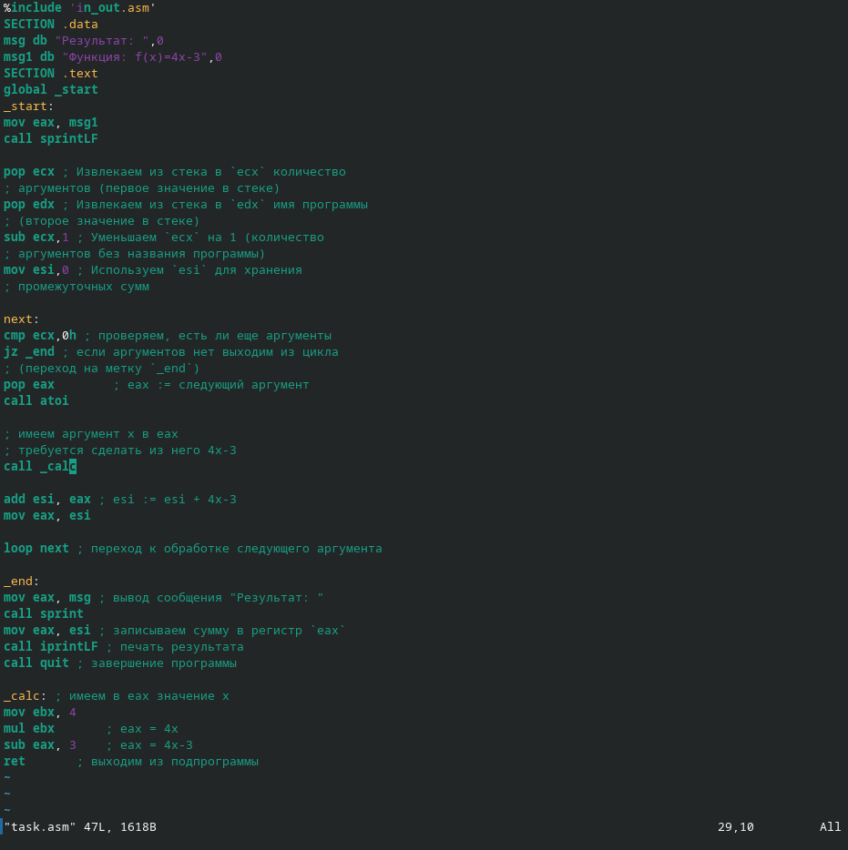{#fig:016 width=85%}

Реализуем с помощью подпрограммы вычисление значения выражения $f(x)=4x-3$. Для этого добавим подпрограмму `_calc`, где, имея в регистре `eax` значение переменной $x$, преобразуем его. Затем инструкцией `ret` выйдем из подпрограммы, оставив результат в `eax`.

Протестируем работу программы (рис. [-@fig:017]).

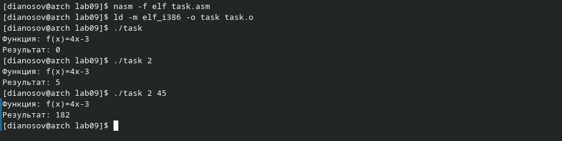{#fig:017 width=85%}

Выводится верный результат.

### Второе задание

В листинге предложен код программы, в котором надо найти и исправить ошибку.
```nasm
%include 'in_out.asm'
SECTION .data
div: DB 'Результат: ',0
SECTION .text
GLOBAL _start
_start:
; ---- Вычисление выражения (3+2)*4+5
mov ebx,3
mov eax,2
add ebx,eax
mov ecx,4
mul ecx
add ebx,5
mov edi,ebx
; ---- Вывод результата на экран
mov eax,div
call sprint
mov eax,edi
call iprintLF
call quit
```
Будем использовать для этого отладчик **GDB** (рис. [-@fig:018]).
Установим точку останова на метке `_start`, войдём в режим отображения значений регистров, поменяем стиль имён регистров на `intel`.

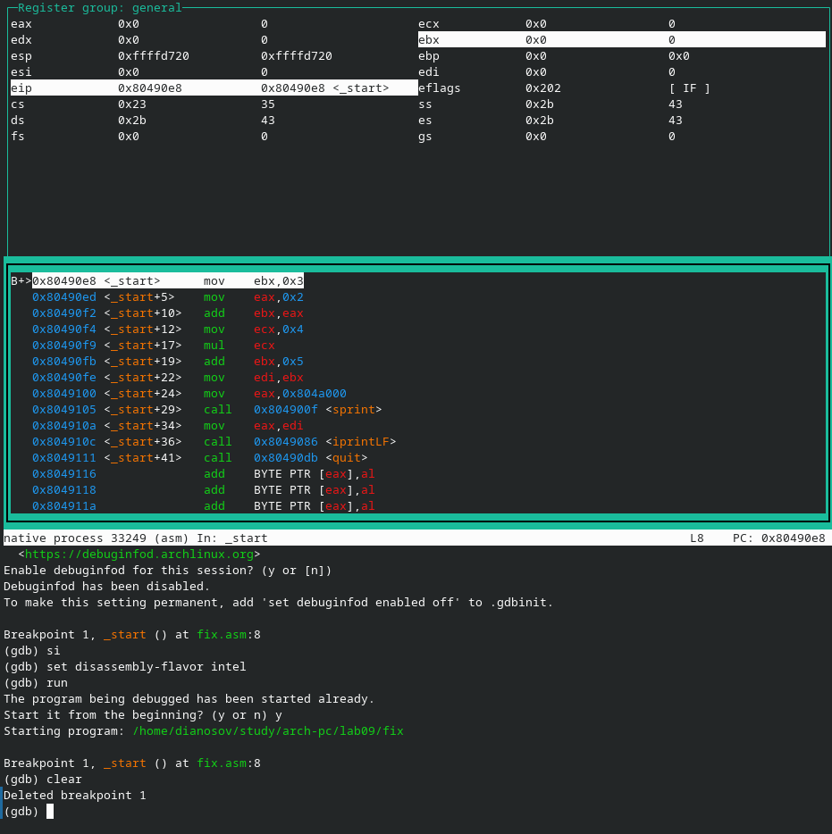{#fig:018 width=85%}

Напомним: программа должна вычислять значние выражения $(3 + 2)\times4 + 5$
Пройдём последовательно на несколько инструкций вперёд повторным вводом команды `si` (рис. [-@fig:019]).

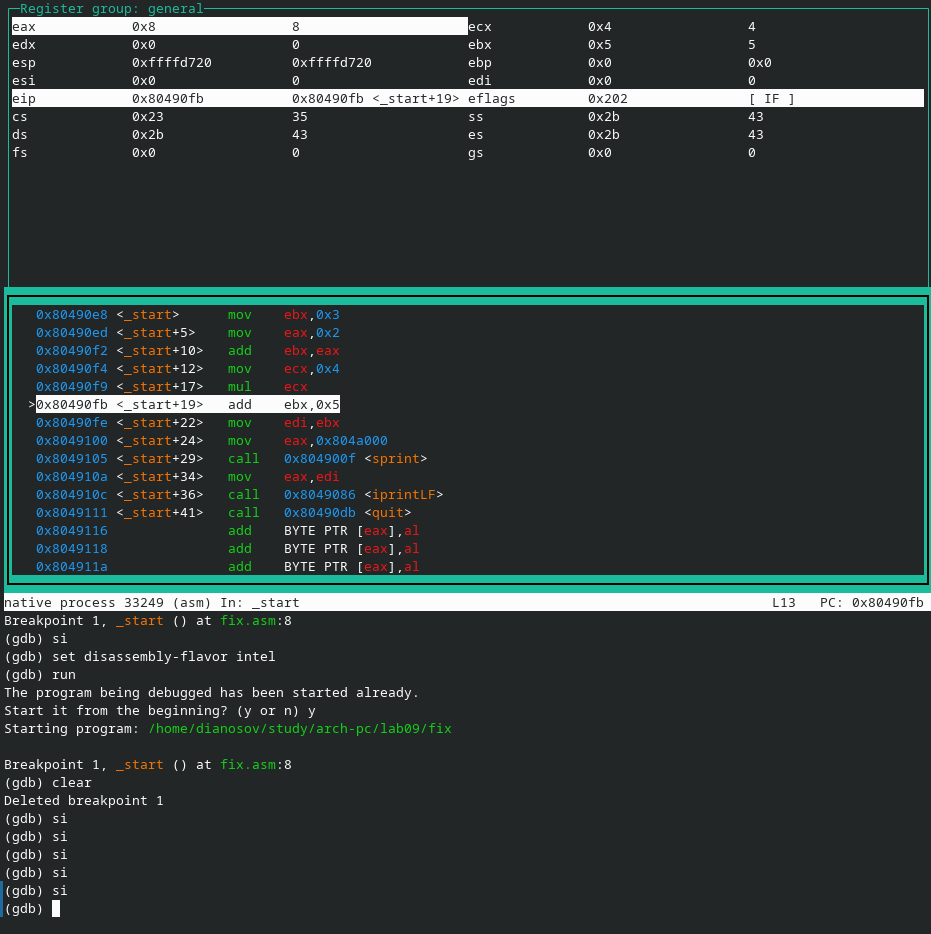{#fig:019 width=85%}

Видим, что на $2$ умножается не сумма $3+2$, лежащая в регистре `ebx`, а только число $2$ в регистре `eax`. Это происходит из-за того, что инструкция `mul x` умножает значение регистра `eax` на значение `x`.
Чтобы исправить ошибку, поменяем инструкцию `add ebx, eax` на `add eax, ebx`, чтобы значение $3+2$ помещалось не в `ebx`, а не в `eax`. 
Также, поскольку теперь мы имеем результат в регистре `eax`, поменяем `add ebx, 5` на `add eax, 5` и `mov edi, ebx` на `mov edi, eax`.

Изменив код, проверим корректность его работы (рис. [-@fig:020]).

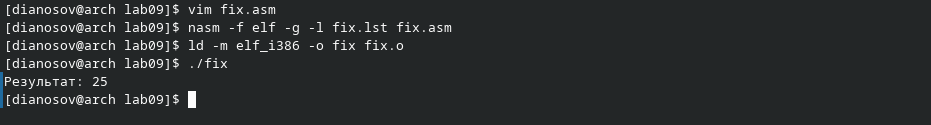{#fig:020 width=85%}

Программа работает корректно. Задание выполнено.

Загрузим файлы на GitHub (рис. [-@fig:021]).

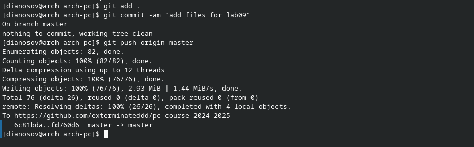{#fig:021 width=85%}


# Выводы

В ходе выполнения лабораторной работы были приобретены навыки написания программ с использованием циклов и обработкой аргументов командной строки.
