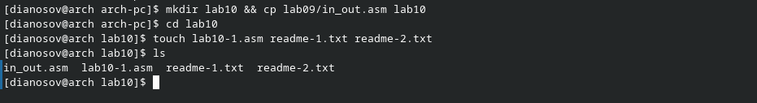

---
## Front matter
title: "Отчёт по лабораторной работе №9"
subtitle: "дисциплина: Архитектура компьютера"
author: "Аносов Даниил Игоревич"

## Generic otions
lang: ru-RU
toc-title: "Содержание"

## Bibliography
bibliography: bib/cite.bib
csl: pandoc/csl/gost-r-7-0-5-2008-numeric.csl

## Pdf output format
toc: true # Table of contents
toc-depth: 2
lof: true # List of figures
lot: true # List of tables
fontsize: 12pt
linestretch: 1.5
papersize: a4
documentclass: scrreprt
## I18n polyglossia
polyglossia-lang:
  name: russian
  options:
	- spelling=modern
	- babelshorthands=true
polyglossia-otherlangs:
  name: english
## I18n babel
babel-lang: russian
babel-otherlangs: english
## Fonts
mainfont: IBM Plex Serif
romanfont: IBM Plex Serif
sansfont: IBM Plex Sans
monofont: IBM Plex Mono
mathfont: STIX Two Math
mainfontoptions: Ligatures=Common,Ligatures=TeX,Scale=0.94
romanfontoptions: Ligatures=Common,Ligatures=TeX,Scale=0.94
sansfontoptions: Ligatures=Common,Ligatures=TeX,Scale=MatchLowercase,Scale=0.94
monofontoptions: Scale=MatchLowercase,Scale=0.94,FakeStretch=0.9
mathfontoptions:
## Biblatex
biblatex: true
biblio-style: "gost-numeric"
biblatexoptions:
  - parentracker=true
  - backend=biber
  - hyperref=auto
  - language=auto
  - autolang=other
  - citestyle=gost-numeric
## Pandoc-crossref LaTeX customization
figureTitle: "Рис."
tableTitle: "Таблица"
listingTitle: "Листинг"
lofTitle: "Список иллюстраций"
lotTitle: "Список таблиц"
lolTitle: "Листинги"
## Misc options
indent: true
header-includes:
  - \usepackage{indentfirst}
  - \usepackage{float} # keep figures where there are in the text
  - \floatplacement{figure}{H} # keep figures where there are in the text
---

# Цель работы
Приобретение навыков написания программ для работы с файлами.

# Задание

1. Напишите программу работающую по следующему алгоритму:
- вывод приглашения “Как Вас зовут?”
- ввести с клавиатуры свои фамилию и имя
- создать файл с именем name.txt
- записать в файл сообщение “Меня зовут”
- дописать в файл строку введенную с клавиатуры
- закрыть файл

# Выполнение лабораторной работы

Откроем терминал и создадим каталог для программ лабораторной работы №10. В новом каталоге создадим файлы *lab10-1.asm*, *readme-1.txt* и *readme-2.txt*:. (рис. [-@fig:001]).

{#fig:001 width=85%}

Введём в файл *lab10-1.asm* текст программы из предложенного листинга. (рис. [-@fig:002]).

{#fig:002 width=85%}

Скомпилируем программу и создадим исполняемый файл.
С помощью команды `chmod` изменим права доступа к исполняемому файлу `lab10-1`, запретив его выполнение. Попытаемся выполнить файл. Объясним результат (рис. [-@fig:003]).

Чтобы запретить выполнение файла, нужно отменить(`-`) право на его выполнение (`x`), т.е. нужная команда: `chmod -x lab10-1`.

{#fig:003 width=85%}

Как и ожидалось, файл выполнить не удаётся по причине "Permission denied" - "Недостаточно прав".

С помощью команды chmod изменим права доступа к файлу `lab10-1.asm` с исходным текстом программы, добавив права на исполнение. Попытаемся выполнить его и объясним результат (рис. [-@fig:004]).

{#fig:004 width=85%}

Текстовые файлы по умолчанию в ОС **Linux** выполняются как **shell**-скрипты. Интерпретатор не может прочитать код, написанный на **NASM**, поэтому выдаёт ошибку.

В соответствии с вариантом в таблице 10.4 предоставим права доступа к файлу `readme-1.txt` представленные в символьном виде, а для файла `readme-2.txt` – в двочном виде. Проверим правильность выполнения с помощью команды `ls -l`.
Моему варианту (№ 6) соответствует набор прав `w- r-x -w-` / `011 001 111`.
Двоичное значение переведём в восьмеричную систему: `011 001 111 = 3 1 7`

Присвоим файлам нужные права, проверим правильность командой `ls -l` (рис. [-@fig:005]).

{#fig:005 width=85%}

# Задание для самостоятельной работы

Требуется написать программу, работающую по следующему сценарию:
- вывод приглашения “Как Вас зовут?”
- ввести с клавиатуры свои фамилию и имя
- создать файл с именем name.txt
- записать в файл сообщение “Меня зовут”
- дописать в файл строку введенную с клавиатуры
- закрыть файл

Создадим файл *task.asm*.
Откроем его в редакторе **Vim** (рис. [-@fig:06]).
Напишем программу (код прокомментрован).

{#fig:06 width=85%}

Протестируем работу программы (рис. [-@fig:07]).

{#fig:07 width=85%}

Программа работает корректно. Задание выполнено.

Загрузим файлы на GitHub (рис. [-@fig:08]).

{#fig:08 width=85%}

# Выводы

Приобретены навыки написания программ для работы с файлами.
